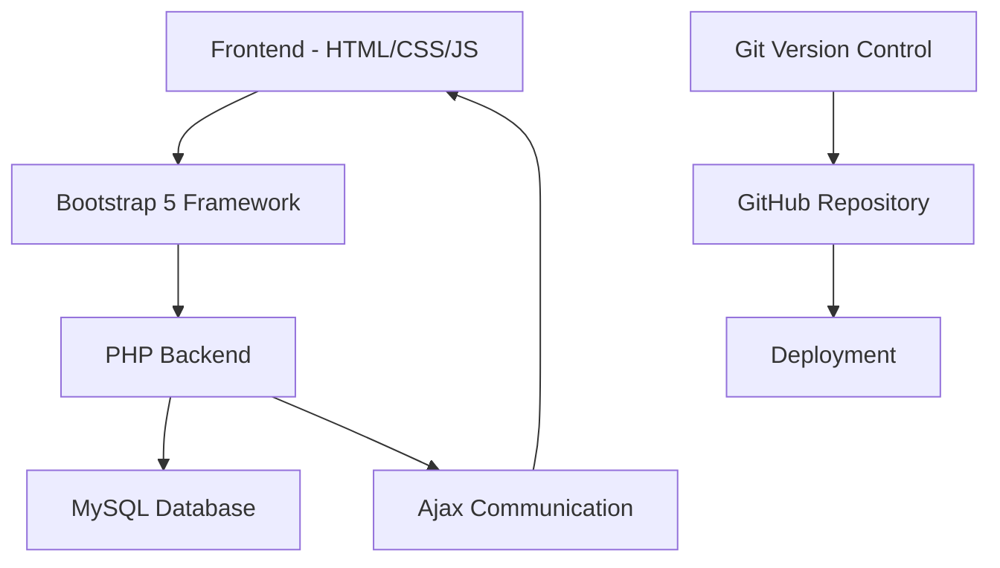
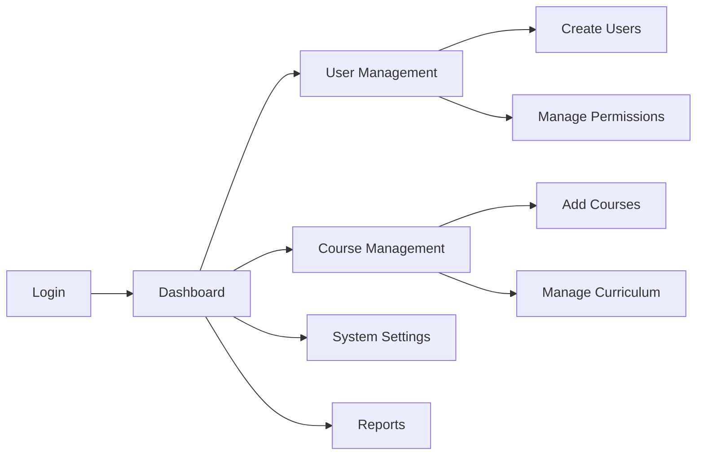
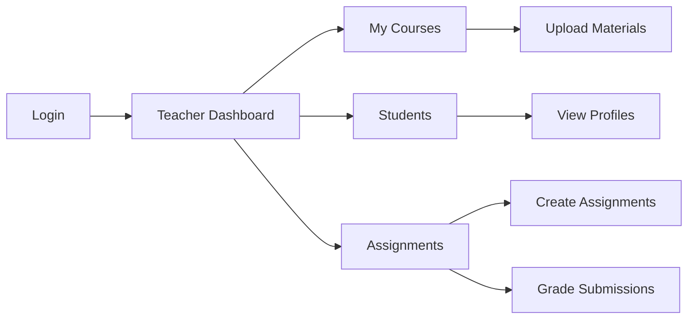
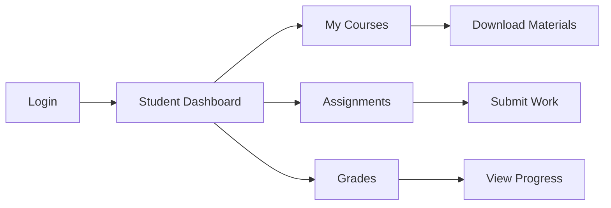
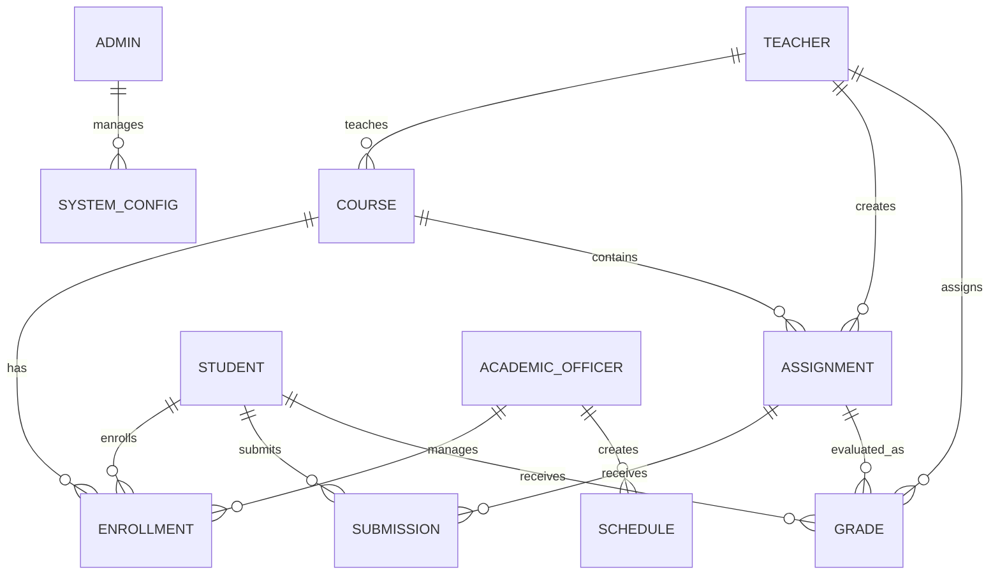

# 🎓 Online School Management System

<div align="center">

[](https://opensource.org/licenses/MIT)
[](https://www.php.net/)
[](https://www.mysql.com/)
[](https://getbootstrap.com/)
[](https://github.com/isharax9/School-management-system)

**A comprehensive Learning Management System (LMS) designed for modern educational institutions**

[🌐 Live Demo](https://isharax9.github.io/School-management-system/) | [📖 Documentation](https://isharax9.github.io/School-management-system/) | [🐛 Report Bug](https://github.com/isharax9/School-management-system/issues) | [💡 Request Feature](https://github.com/isharax9/School-management-system/issues)

</div>

---

## 🖼️ System Preview

<div align="center">
  

*Experience our intuitive and user-friendly interface designed for seamless educational management*
</div>

---

## 🚀 Quick Start

```bash
# Clone the repository
git clone https://github.com/isharax9/School-management-system.git

# Navigate to project directory
cd School-management-system

# Import database
mysql -u username -p school_management_system < school_management_system.sql

# Configure your web server to point to the project directory
# Access via browser: http://localhost/School-management-system
```

---
## 📋 Table of Contents

- [🎯 About The Project](#-about-the-project)
- [✨ Features](#-features)
- [👥 User Roles](#-user-roles)
- [🛠️ Built With](#️-built-with)
- [📦 Installation](#-installation)
- [⚙️ Configuration](#️-configuration)
- [🎮 Usage](#-usage)
- [🗄️ Database Structure](#️-database-structure)
- [🎨 UI Overview](#-ui-overview)
- [🔧 API Documentation](#-api-documentation)
- [🤝 Contributing](#-contributing)
- [📝 License](#-license)
- [👨‍💻 Author](#-author)
- [🙏 Acknowledgments](#-acknowledgments)
- [📞 Support](#-support)

---

## 🎯 About The Project

Welcome to the **Online School Management System** - an innovative and comprehensive [Learning Management System (LMS)](https://en.wikipedia.org/wiki/Learning_management_system) designed to revolutionize educational institution management. This powerful web application combines cutting-edge technologies to deliver a seamless, efficient, and user-friendly educational experience.

### 🎯 Purpose

The Online School Management System is engineered to facilitate **efficient management of educational activities** across all levels of an institution. Our system addresses the complex needs of modern educational environments by providing:

- **Centralized Management**: Unified platform for all educational operations
- **Role-Based Access**: Tailored interfaces for different user types
- **Real-Time Communication**: Instant updates and notifications
- **Data Security**: Robust security measures for sensitive educational data
- **Scalability**: Designed to grow with your institution
- **User-Friendly Interface**: Intuitive design for all skill levels

### 🌟 Key Highlights

- 📚 **Comprehensive LMS** with multi-role support
- 🔐 **Secure Authentication** system with role-based permissions
- 📊 **Real-time Analytics** and reporting capabilities
- 📱 **Responsive Design** compatible with all devices
- 🗄️ **Robust Database** architecture for data integrity
- ⚡ **High Performance** with optimized code structure

---

## ✨ Features

### 🔑 Core Features

<table>
<tr>
<td width="50%">

#### 👨‍💼 **Administrative Features**
- 👥 User management (Students, Teachers, Officers)
- 📋 Course and curriculum management
- 📊 Comprehensive reporting and analytics
- 🔧 System configuration and settings
- 📈 Performance tracking and monitoring
- 🏫 Institution profile management

</td>
<td width="50%">

#### 👨‍🏫 **Teaching Features**
- 📝 Assignment creation and management
- 📚 Lesson notes upload and organization
- 📋 Student attendance tracking
- 🎯 Grade management and reporting
- 💬 Student communication tools
- 📅 Class scheduling and management

</td>
</tr>
<tr>
<td width="50%">

#### 👨‍🎓 **Student Features**
- 📖 Access to course materials
- 📝 Assignment submission system
- 📊 Grade and progress tracking
- 📅 Personal schedule management
- 💬 Teacher communication portal
- 📚 Digital library access

</td>
<td width="50%">

#### 👨‍💼 **Academic Officer Features**
- 📋 Enrollment management
- 📅 Course scheduling
- 📊 Academic reporting
- 🏆 Performance analysis
- 📋 Academic calendar management
- 📈 Statistical analysis tools

</td>
</tr>
</table>

### 🚀 Advanced Features

- **📧 Email Notifications**: Automated alerts and updates
- **📱 Mobile Responsive**: Seamless experience across all devices
- **🔍 Search Functionality**: Quick access to information
- **📊 Dashboard Analytics**: Visual data representation
- **🔄 Real-time Updates**: Live data synchronization
- **📋 Custom Reports**: Generate tailored reports
- **🔐 Security Features**: Multi-layer security implementation
- **💾 Data Backup**: Automated backup solutions

---

## 👥 User Roles

The Online School Management System is designed with a **multi-tier user hierarchy** to ensure appropriate access levels and functionality for different roles within an educational institution.

<div align="center">

| Role | Access Level | Primary Functions | Dashboard Features |
|------|-------------|-------------------|-------------------|
| 👨‍💼 **Admin** | Full System | User Management, System Config | 📊 Analytics, 👥 User Control, ⚙️ Settings |
| 👨‍🏫 **Teacher** | Course Management | Teaching, Grading, Communication | 📚 Courses, 👨‍🎓 Students, 📝 Assignments |
| 👨‍🎓 **Student** | Learning Resources | Learning, Submissions, Communication | 📖 Materials, 📝 Assignments, 📊 Grades |
| 👨‍💼 **Academic Officer** | Academic Operations | Scheduling, Enrollment, Reporting | 📅 Schedule, 📋 Enrollment, 📈 Reports |

</div>

### 👨‍💼 Admin

**Comprehensive System Control**

As an administrator, you have **complete access** to the admin panel, empowering you to oversee all aspects of the educational system:

#### 🔧 **Administrative Capabilities:**
- **👥 User Management**: Create, modify, and manage all user accounts
- **📚 Course Administration**: Oversee course creation, modification, and deletion
- **🔐 Security Management**: Configure security settings and permissions
- **📊 System Analytics**: Access comprehensive reports and analytics
- **⚙️ System Configuration**: Customize system settings and preferences
- **📈 Performance Monitoring**: Track system performance and usage statistics
- **🗄️ Database Management**: Maintain data integrity and perform backups

#### 📋 **Admin Dashboard Features:**
```
✅ User Statistics Overview
✅ System Health Monitoring
✅ Recent Activity Logs
✅ Quick Action Buttons
✅ Performance Metrics
✅ Security Alerts
```

### 👨‍🏫 Teacher

**Educational Content Management**

Teachers access a specialized panel designed to enhance their instructional capabilities and streamline educational delivery:

#### 📚 **Teaching Capabilities:**
- **📝 Content Management**: Upload and organize lesson materials
- **📋 Assignment Creation**: Design and distribute assignments
- **👨‍🎓 Student Interaction**: Communicate directly with students
- **📊 Grade Management**: Assign and track student grades
- **📅 Schedule Management**: Manage class schedules and timing
- **📈 Progress Tracking**: Monitor student progress and performance

#### 📋 **Teacher Dashboard Features:**
```
✅ Class Overview Widget
✅ Assignment Management Panel
✅ Student Progress Charts
✅ Quick Communication Tools
✅ Resource Upload Center
✅ Grade Book Access
```

### 👨‍🎓 Student

**Enhanced Learning Experience**

Students receive access to a comprehensive learning portal designed to maximize their educational journey:

#### 📖 **Learning Capabilities:**
- **📚 Course Access**: View all enrolled course materials
- **📝 Assignment Submission**: Submit assignments electronically
- **💬 Communication**: Interact with teachers and classmates
- **📊 Progress Tracking**: Monitor personal academic progress
- **📅 Schedule Viewing**: Access personal class schedules
- **📋 Resource Library**: Access digital learning resources

#### 📋 **Student Dashboard Features:**
```
✅ Course Materials Library
✅ Assignment Status Tracker
✅ Grade Progress Charts
✅ Upcoming Deadlines
✅ Communication Center
✅ Personal Schedule View
```

### 👨‍💼 Academic Officer

**Academic Operations Management**

Academic officers have specialized access to tools that streamline academic administration and planning:

#### 📋 **Academic Management Capabilities:**
- **📅 Course Scheduling**: Create and manage academic schedules
- **📝 Enrollment Management**: Handle student enrollment processes
- **📊 Report Generation**: Create academic reports and analytics
- **🏆 Performance Analysis**: Analyze institutional performance metrics
- **📋 Academic Calendar**: Manage academic year calendar and events
- **📈 Statistical Analysis**: Generate statistical reports for decision-making

#### 📋 **Academic Officer Dashboard Features:**
```
✅ Enrollment Statistics
✅ Academic Calendar Widget
✅ Report Generation Tools
✅ Performance Analytics
✅ Schedule Management Panel
✅ Student Demographics
```

---

## 🛠️ Built With

Our system is built using a **modern technology stack** that ensures reliability, security, and performance:

<div align="center">

### 🏗️ **Architecture Overview**



</div>

### 💻 **Core Technologies**

<table>
<tr>
<td width="50%">

#### 🔧 **Backend Technologies**
- **[🐘 PHP 7.4+](https://www.php.net/)**
  - Server-side scripting and logic
  - MVC architecture implementation
  - Secure session management
  - Database connectivity and operations

- **[🗄️ MySQL 5.7+](https://www.mysql.com/)**
  - Robust database management
  - ACID compliance for data integrity
  - Optimized queries for performance
  - Secure data storage and retrieval

</td>
<td width="50%">

#### 🎨 **Frontend Technologies**
- **[📱 HTML5](https://developer.mozilla.org/en-US/docs/Web/HTML)**
  - Semantic markup structure
  - Accessibility compliance
  - Modern web standards

- **[🎨 CSS3 & Bootstrap 5](https://getbootstrap.com/)**
  - Responsive design framework
  - Mobile-first approach
  - Custom styling and themes
  - Cross-browser compatibility

- **[⚡ JavaScript ES6+](https://developer.mozilla.org/en-US/docs/Web/JavaScript)**
  - Dynamic user interactions
  - Client-side validation
  - Real-time updates
  - Enhanced user experience

</td>
</tr>
</table>

### 🔄 **Integration Technologies**

#### **[🔄 Ajax (Asynchronous JavaScript)](https://developer.mozilla.org/en-US/docs/Web/Guide/AJAX/Getting_Started)**
- **Real-time Communication**: Seamless frontend-backend data exchange
- **Dynamic Content Loading**: Update page content without full page reloads
- **Enhanced User Experience**: Smooth, responsive interactions
- **Efficient Data Transfer**: Minimized bandwidth usage

### 🛠️ **Development Tools**

#### **[📚 Git & GitHub](https://github.com/)**
- **Version Control**: Track changes and collaborate effectively
- **Code Management**: Organized repository structure
- **Collaboration**: Multiple developer support
- **Backup & Recovery**: Secure code storage and history

### 🏛️ **System Architecture**

#### **📁 Project Structure**
```
School-Management-System/
├── 📁 Admin/           # Administrator module
│   ├── Controller/     # Business logic
│   ├── Model/         # Data access layer
│   ├── View/          # User interface
│   └── Resources/     # Assets and files
├── 📁 Teacher/        # Teacher module
├── 📁 Student/        # Student module
├── 📁 Officer/        # Academic officer module
├── 📁 Home/           # Public interface
├── 📁 other/          # Documentation assets
├── 🗄️ database.sql    # Database schema
└── 📄 README.md       # Documentation
```

#### **🔄 Design Patterns**
- **MVC Architecture**: Clean separation of concerns
- **Modular Design**: Independent, reusable components
- **RESTful Principles**: Standardized API interactions
- **Security by Design**: Built-in security measures

### 🚀 **Performance Features**

<div align="center">

| Feature | Implementation | Benefit |
|---------|---------------|---------|
| **🔄 Ajax Loading** | Asynchronous requests | ⚡ Faster page loads |
| **📱 Responsive Design** | Bootstrap framework | 📱 Multi-device support |
| **🗄️ Optimized Queries** | Indexed database | 🚀 Quick data retrieval |
| **🔐 Secure Sessions** | PHP session management | 🛡️ User data protection |
| **📊 Caching** | Strategic data caching | ⚡ Improved performance |

</div>

---

## 📦 Installation

### 📋 **Prerequisites**

Before installation, ensure your system meets these requirements:

<div align="center">

| Component | Minimum Version | Recommended |
|-----------|----------------|-------------|
| **🔧 PHP** | 7.4 | 8.0+ |
| **🗄️ MySQL** | 5.7 | 8.0+ |
| **🌐 Web Server** | Apache 2.4 / Nginx 1.18 | Latest |
| **💾 Storage** | 100MB | 500MB+ |
| **🧠 RAM** | 512MB | 2GB+ |

</div>

### 🚀 **Quick Installation**

#### **1️⃣ Clone Repository**
```bash
# Clone the repository
git clone https://github.com/isharax9/School-management-system.git

# Navigate to project directory
cd School-management-system
```

#### **2️⃣ Database Setup**
```sql
-- Create database
CREATE DATABASE school_management_system;

-- Import schema
mysql -u your_username -p school_management_system < school_management_system.sql
```

#### **3️⃣ Web Server Configuration**

**📁 For Apache:**
```apache
<VirtualHost *:80>
    DocumentRoot "/path/to/School-management-system"
    ServerName school-management.local
    
    <Directory "/path/to/School-management-system">
        AllowOverride All
        Require all granted
    </Directory>
</VirtualHost>
```

**📁 For Nginx:**
```nginx
server {
    listen 80;
    server_name school-management.local;
    root /path/to/School-management-system;
    index index.php index.html;

    location ~ \.php$ {
        fastcgi_pass 127.0.0.1:9000;
        fastcgi_index index.php;
        include fastcgi_params;
    }
}
```

#### **4️⃣ File Permissions**
```bash
# Set proper permissions
chmod -R 755 /path/to/School-management-system
chmod -R 777 /path/to/School-management-system/uploads  # If uploads folder exists
```

### 🔧 **Detailed Installation Steps**

<details>
<summary><strong>📖 Click to expand detailed installation guide</strong></summary>

#### **Step 1: System Preparation**
```bash
# Update system packages
sudo apt update && sudo apt upgrade -y

# Install required packages
sudo apt install apache2 mysql-server php php-mysql php-mysqli -y

# Start services
sudo systemctl start apache2
sudo systemctl start mysql
sudo systemctl enable apache2
sudo systemctl enable mysql
```

#### **Step 2: Database Configuration**
```bash
# Secure MySQL installation
sudo mysql_secure_installation

# Access MySQL
sudo mysql -u root -p

# Create database and user
CREATE DATABASE school_management_system;
CREATE USER 'school_user'@'localhost' IDENTIFIED BY 'secure_password';
GRANT ALL PRIVILEGES ON school_management_system.* TO 'school_user'@'localhost';
FLUSH PRIVILEGES;
EXIT;
```

#### **Step 3: Project Setup**
```bash
# Clone to web directory
sudo git clone https://github.com/isharax9/School-management-system.git /var/www/html/school-system

# Set ownership
sudo chown -R www-data:www-data /var/www/html/school-system

# Import database
mysql -u school_user -p school_management_system < /var/www/html/school-system/school_management_system.sql
```

#### **Step 4: Configuration Files**
Create database configuration file:
```php
<?php
// Database configuration
define('DB_HOST', 'localhost');
define('DB_NAME', 'school_management_system');
define('DB_USER', 'school_user');
define('DB_PASS', 'secure_password');
?>
```

</details>

---

## ⚙️ Configuration

### 🔧 **Database Configuration**

#### **Connection Settings**
Update the database connection files in each module:

```php
// Admin/Model/DatabaseConnection.php
// Teacher/Model/DatabaseConnection.php  
// Student/Model/DatabaseConnection.php
// Officer/Model/DatabaseConnection.php

<?php
$servername = "localhost";
$username = "your_database_username";
$password = "your_database_password"; 
$dbname = "school_management_system";

// Create connection
$conn = new mysqli($servername, $username, $password, $dbname);

// Check connection
if ($conn->connect_error) {
    die("Connection failed: " . $conn->connect_error);
}
?>
```

#### **🔐 Security Configuration**

**Session Security:**
```php
// Configure in each module's session handling
ini_set('session.cookie_httponly', 1);
ini_set('session.cookie_secure', 1);
ini_set('session.use_strict_mode', 1);
session_set_cookie_params([
    'lifetime' => 3600,
    'path' => '/',
    'domain' => '',
    'secure' => true,
    'httponly' => true,
    'samesite' => 'Strict'
]);
```

### 🎛️ **System Configuration**

#### **Default Admin Credentials**
```
Username: 0001
Password: 11010001#
Email: ishara@gmail.com
```

⚠️ **Important**: Change these default credentials immediately after installation!

#### **📧 Email Configuration** (Optional)
```php
// For notification features
define('SMTP_HOST', 'your_smtp_host');
define('SMTP_PORT', 587);
define('SMTP_USERNAME', 'your_email@domain.com');
define('SMTP_PASSWORD', 'your_email_password');
```

#### **🔒 File Upload Settings**
```php
// Configure in php.ini or .htaccess
upload_max_filesize = 10M
post_max_size = 12M
max_execution_time = 300
```

---

## 🎮 Usage

### 👤 **Getting Started**

#### **1️⃣ Access the System**
- Navigate to: `http://your-domain.com/School-management-system`
- You'll see the main dashboard with role selection

#### **2️⃣ User Registration & Login**

<table>
<tr>
<td width="50%">

**🔐 For Administrators:**
```
1. Use default admin credentials (change immediately)
2. Access Admin Panel
3. Create user accounts for other roles
4. Configure system settings
```

</td>
<td width="50%">

**👥 For Other Users:**
```
1. Register through respective role pages
2. Wait for admin approval (if required)
3. Login with approved credentials
4. Complete profile setup
```

</td>
</tr>
</table>

### 📋 **User Workflows**

#### **👨‍💼 Admin Workflow**


#### **👨‍🏫 Teacher Workflow**


#### **👨‍🎓 Student Workflow**


### 🔧 **Common Operations**

<details>
<summary><strong>👨‍💼 Admin Operations</strong></summary>

#### **User Management**
```php
// Create new user
POST /Admin/Controller/userCreate.php
{
    "name": "John Doe",
    "email": "john@school.edu", 
    "role": "teacher",
    "password": "secure_password"
}

// Update user permissions
POST /Admin/Controller/updatePermissions.php
{
    "user_id": "1234",
    "permissions": ["course_create", "grade_manage"]
}
```

#### **Course Management**
```php
// Add new course
POST /Admin/Controller/courseCreate.php
{
    "course_name": "Mathematics",
    "class": "Grade 10",
    "description": "Advanced Mathematics Course"
}
```

</details>

<details>
<summary><strong>👨‍🏫 Teacher Operations</strong></summary>

#### **Assignment Management**
```php
// Create assignment
POST /Teacher/Controller/assignmentCreate.php
{
    "title": "Math Assignment 1",
    "description": "Solve algebra problems",
    "due_date": "2024-02-15",
    "class": "Grade 10"
}

// Upload lesson notes
POST /Teacher/Controller/notesUpload.php
// File upload with metadata
```

#### **Grade Management**
```php
// Submit grades
POST /Teacher/Controller/gradeSubmit.php
{
    "student_id": "2001",
    "assignment_id": "5001", 
    "grade": "85",
    "feedback": "Good work!"
}
```

</details>

<details>
<summary><strong>👨‍🎓 Student Operations</strong></summary>

#### **Assignment Submission**
```php
// Submit assignment
POST /Student/Controller/assignmentSubmit.php
// File upload with assignment ID

// View grades
GET /Student/Controller/gradesView.php?student_id=2001
```

#### **Course Access**
```php
// Get course materials
GET /Student/Controller/courseMaterials.php?course_id=3001

// Download notes
GET /Student/Controller/downloadNotes.php?note_id=4001
```

</details>

---

## 🗄️ Database Structure

### 📊 **Database Schema Overview**

<div align="center">


*Comprehensive database structure designed for optimal data organization and relationships*
</div>

The database architecture is meticulously designed to ensure **data integrity**, **performance optimization**, and **scalable growth** for educational institutions of any size.

### 🗄️ **Core Tables Structure**

<details>
<summary><strong>👨‍💼 Administrative Tables</strong></summary>

#### **🔑 Admin Table**
```sql
CREATE TABLE `admin` (
  `id` varchar(20) NOT NULL PRIMARY KEY,
  `name` varchar(70) NOT NULL,
  `email` varchar(70) NOT NULL UNIQUE,
  `password` varchar(70) NOT NULL,
  `created_at` timestamp DEFAULT CURRENT_TIMESTAMP,
  `last_login` timestamp NULL,
  `status` enum('active','inactive') DEFAULT 'active'
);
```

**Features:**
- ✅ Unique identification system
- ✅ Encrypted password storage
- ✅ Activity tracking
- ✅ Status management

</details>

<details>
<summary><strong>👨‍🏫 Teacher Management Tables</strong></summary>

#### **📚 Teacher Table**
```sql
CREATE TABLE `teacher` (
  `id` varchar(20) NOT NULL PRIMARY KEY,
  `name` varchar(70) NOT NULL,
  `email` varchar(70) NOT NULL UNIQUE,
  `mobile` varchar(15) NOT NULL,
  `password` varchar(70) NOT NULL,
  `gender` enum('Male','Female','Other') NOT NULL,
  `date_of_birth` date NOT NULL,
  `subject_specialization` varchar(100),
  `qualification` text,
  `hire_date` date DEFAULT (CURRENT_DATE),
  `status` enum('active','inactive','on_leave') DEFAULT 'active',
  `created_at` timestamp DEFAULT CURRENT_TIMESTAMP
);
```

**Features:**
- ✅ Complete profile management
- ✅ Subject specialization tracking
- ✅ Qualification records
- ✅ Employment status monitoring

</details>

<details>
<summary><strong>👨‍🎓 Student Management Tables</strong></summary>

#### **🎓 Student Table**
```sql
CREATE TABLE `student` (
  `id` varchar(20) NOT NULL PRIMARY KEY,
  `name` varchar(70) NOT NULL,
  `email` varchar(70) NOT NULL UNIQUE,
  `mobile` varchar(15) NOT NULL,
  `password` varchar(70) NOT NULL,
  `gender` enum('Male','Female','Other') NOT NULL,
  `date_of_birth` date NOT NULL,
  `present_address` text NOT NULL,
  `class` varchar(20) NOT NULL,
  `section` varchar(10) NOT NULL,
  `roll_number` varchar(20) NOT NULL UNIQUE,
  `guardian_name` varchar(70),
  `guardian_contact` varchar(15),
  `admission_date` date DEFAULT (CURRENT_DATE),
  `status` enum('active','inactive','graduated','transferred') DEFAULT 'active',
  `created_at` timestamp DEFAULT CURRENT_TIMESTAMP
);
```

**Features:**
- ✅ Comprehensive student profiles
- ✅ Guardian information
- ✅ Class and section management
- ✅ Academic status tracking

</details>

<details>
<summary><strong>📚 Academic Management Tables</strong></summary>

#### **📖 Course Table**
```sql
CREATE TABLE `course` (
  `id` int(11) NOT NULL AUTO_INCREMENT PRIMARY KEY,
  `course_name` varchar(100) NOT NULL,
  `course_code` varchar(20) NOT NULL UNIQUE,
  `class` varchar(20) NOT NULL,
  `description` text,
  `teacher_id` varchar(20),
  `credits` int(2) DEFAULT 1,
  `semester` varchar(20),
  `academic_year` varchar(10),
  `status` enum('active','inactive','completed') DEFAULT 'active',
  `created_at` timestamp DEFAULT CURRENT_TIMESTAMP,
  FOREIGN KEY (`teacher_id`) REFERENCES `teacher`(`id`)
);
```

#### **📝 Assignment Table**
```sql
CREATE TABLE `assignment` (
  `id` int(11) NOT NULL AUTO_INCREMENT PRIMARY KEY,
  `title` varchar(100) NOT NULL,
  `description` text NOT NULL,
  `course_id` int(11) NOT NULL,
  `teacher_id` varchar(20) NOT NULL,
  `class` varchar(20) NOT NULL,
  `due_date` datetime NOT NULL,
  `max_marks` int(3) DEFAULT 100,
  `file_path` varchar(255),
  `status` enum('active','expired','draft') DEFAULT 'active',
  `created_at` timestamp DEFAULT CURRENT_TIMESTAMP,
  FOREIGN KEY (`course_id`) REFERENCES `course`(`id`),
  FOREIGN KEY (`teacher_id`) REFERENCES `teacher`(`id`)
);
```

#### **📊 Grade Table**
```sql
CREATE TABLE `grade` (
  `id` int(11) NOT NULL AUTO_INCREMENT PRIMARY KEY,
  `student_id` varchar(20) NOT NULL,
  `assignment_id` int(11) NOT NULL,
  `marks_obtained` decimal(5,2),
  `grade_letter` char(2),
  `feedback` text,
  `graded_by` varchar(20) NOT NULL,
  `graded_at` timestamp DEFAULT CURRENT_TIMESTAMP,
  `status` enum('graded','pending','resubmission') DEFAULT 'pending',
  FOREIGN KEY (`student_id`) REFERENCES `student`(`id`),
  FOREIGN KEY (`assignment_id`) REFERENCES `assignment`(`id`),
  FOREIGN KEY (`graded_by`) REFERENCES `teacher`(`id`)
);
```

</details>

### 🔗 **Database Relationships**



### 🎯 **Database Features**

<div align="center">

| Feature | Implementation | Benefit |
|---------|---------------|---------|
| **🔐 Data Integrity** | Foreign Key Constraints | Prevents orphaned records |
| **⚡ Performance** | Strategic Indexing | Fast query execution |
| **🔄 Backup Support** | MySQL Dump Compatible | Easy data migration |
| **📊 Analytics Ready** | Normalized Structure | Efficient reporting |
| **🔒 Security** | Parameterized Queries | SQL injection prevention |

</div>

### 📈 **Database Performance Optimization**

#### **Indexing Strategy**
```sql
-- Primary performance indexes
CREATE INDEX idx_student_class ON student(class, section);
CREATE INDEX idx_course_teacher ON course(teacher_id, status);
CREATE INDEX idx_assignment_due ON assignment(due_date, status);
CREATE INDEX idx_grade_student ON grade(student_id, graded_at);

-- Search optimization indexes  
CREATE INDEX idx_student_search ON student(name, email);
CREATE INDEX idx_teacher_search ON teacher(name, email);
CREATE FULLTEXT INDEX idx_course_search ON course(course_name, description);
```

#### **Query Optimization Examples**
```sql
-- Optimized student grade retrieval
SELECT s.name, c.course_name, g.marks_obtained, g.grade_letter
FROM student s
JOIN grade g ON s.id = g.student_id  
JOIN assignment a ON g.assignment_id = a.id
JOIN course c ON a.course_id = c.id
WHERE s.id = ? AND g.status = 'graded'
ORDER BY g.graded_at DESC;

-- Efficient teacher workload query
SELECT t.name, COUNT(c.id) as course_count, COUNT(a.id) as assignment_count
FROM teacher t
LEFT JOIN course c ON t.id = c.teacher_id
LEFT JOIN assignment a ON c.id = a.course_id
WHERE t.status = 'active'
GROUP BY t.id, t.name;
```

---

## 🎨 UI Overview

### 🎨 **Design Philosophy**

Our user interface is crafted with **modern design principles** focusing on:
- **🎯 User-Centric Design**: Intuitive navigation for all skill levels
- **📱 Responsive Layout**: Seamless experience across all devices
- **🎨 Visual Hierarchy**: Clear information organization
- **♿ Accessibility**: Compliant with web accessibility standards
- **⚡ Performance**: Optimized for fast loading and smooth interactions

### 🖥️ **Interface Components**

#### **🏠 Login & Home Page**

<div align="center">

**🔐 Secure Authentication Portal**

The login interface serves as the **secure gateway** to the system, featuring:
- **Multi-role authentication** with role-specific redirects
- **Password security validation** with encryption
- **Session management** for secure access control
- **Remember me functionality** for user convenience
- **Password recovery system** for account management

</div>

**Key Features:**
```
✅ Role-based login system
✅ Secure session handling  
✅ Input validation & sanitization
✅ Brute force protection
✅ Mobile-responsive design
```

#### **📊 Dashboard Interfaces**

<table>
<tr>
<td width="50%">

##### **👨‍💼 Admin Dashboard**
```
🏠 System Overview Widget
├── 📊 User Statistics (Students/Teachers/Officers)
├── 📈 System Performance Metrics  
├── 🔔 Recent Activity Feed
├── ⚠️ System Alerts & Notifications
└── 🔧 Quick Action Panel

📋 Management Tools
├── 👥 User Management Interface
├── 📚 Course Administration Panel
├── 📊 Analytics & Reporting Hub
├── ⚙️ System Configuration
└── 🗄️ Database Management Tools
```

</td>
<td width="50%">

##### **👨‍🏫 Teacher Dashboard**
```
📚 Teaching Hub
├── 📖 My Courses Overview
├── 👨‍🎓 Student Management Panel
├── 📝 Assignment Creation Tools
├── 📊 Grade Management System
└── 📅 Class Schedule View

🔧 Tools & Resources
├── 📁 Resource Upload Center
├── 💬 Communication Portal
├── 📈 Performance Analytics
├── 📋 Attendance Tracker
└── 🔔 Notification Center
```

</td>
</tr>
<tr>
<td width="50%">

##### **👨‍🎓 Student Dashboard**
```
📖 Learning Center
├── 📚 My Courses Library
├── 📝 Assignment Tracker
├── 📊 Grade & Progress View
├── 📅 Personal Schedule
└── 🔔 Announcements Feed

🎓 Academic Tools
├── 📁 Download Center
├── 📝 Submission Portal
├── 💬 Teacher Communication
├── 📈 Progress Analytics
└── 📋 Academic Calendar
```

</td>
<td width="50%">

##### **👨‍💼 Academic Officer Dashboard**
```
📋 Administrative Hub
├── 📊 Enrollment Statistics
├── 📅 Academic Calendar Management
├── 📈 Performance Analytics
├── 🏫 Institutional Reports
└── 📋 Schedule Management

🔧 Officer Tools
├── 👥 Enrollment Management
├── 📊 Report Generation
├── 📅 Event Scheduling
├── 📈 Statistical Analysis
└── 🗃️ Record Management
```

</td>
</tr>
</table>

### 📱 **Responsive Design Features**

#### **🖥️ Desktop Experience**
- **Full-featured interface** with all functionality visible
- **Multi-panel layout** for efficient navigation
- **Advanced data tables** with sorting and filtering
- **Drag-and-drop functionality** for file uploads
- **Keyboard shortcuts** for power users

#### **📱 Mobile Experience**
- **Collapsible navigation menu** for space optimization
- **Touch-friendly buttons** and interactive elements
- **Swipe gestures** for intuitive navigation
- **Optimized forms** for mobile input
- **Progressive disclosure** of information

#### **📊 Tablet Experience**
- **Hybrid layout** combining desktop and mobile features
- **Optimized for portrait and landscape** orientations
- **Touch-optimized controls** for tablet interaction
- **Adaptive grid systems** for content organization

### 🎨 **Visual Design Elements**

#### **🎨 Color Scheme & Branding**
```css
:root {
  --primary-color: #007bff;      /* Professional Blue */
  --secondary-color: #6c757d;    /* Neutral Gray */
  --success-color: #28a745;      /* Success Green */
  --warning-color: #ffc107;      /* Warning Amber */
  --danger-color: #dc3545;       /* Error Red */
  --info-color: #17a2b8;         /* Information Cyan */
}
```

#### **📝 Typography System**
- **Primary Font**: 'Roboto', sans-serif
- **Heading Font**: 'Inter', sans-serif  
- **Monospace Font**: 'Fira Code', monospace
- **Font Scales**: Responsive typography scaling
- **Line Heights**: Optimized for readability

#### **🔲 Component Library**
<div align="center">

| Component | Description | Usage |
|-----------|-------------|-------|
| **🔘 Buttons** | Interactive action triggers | Form submissions, navigation |
| **📝 Forms** | Data input interfaces | User registration, data entry |
| **📊 Tables** | Data presentation grids | Lists, reports, analytics |
| **🔔 Alerts** | Status notifications | Success, error, warning messages |
| **📋 Cards** | Content containers | Dashboard widgets, information blocks |
| **🎛️ Navigation** | Site navigation elements | Menus, breadcrumbs, pagination |

</div>

### 🔧 **Accessibility Features**

#### **♿ Web Accessibility Compliance**
- **WCAG 2.1 AA compliance** for inclusive design
- **Keyboard navigation support** for all interactive elements
- **Screen reader compatibility** with semantic HTML
- **High contrast mode** for visual accessibility
- **Focus indicators** for navigation clarity
- **Alt text for images** and descriptive content

#### **🌐 Multi-language Support** (Planned)
- **Internationalization ready** codebase
- **RTL language support** for global accessibility
- **Cultural adaptation** for different regions

### ⚡ **Performance Optimizations**

#### **🚀 Loading Optimizations**
- **Lazy loading** for images and content
- **Progressive enhancement** for gradual loading
- **Minified CSS/JS** for faster downloads
- **CDN integration** for global content delivery
- **Caching strategies** for repeat visits

#### **📊 User Experience Metrics**
```
⚡ Page Load Time: < 2 seconds
🎯 First Contentful Paint: < 1.5 seconds  
📱 Mobile PageSpeed Score: 90+
🖥️ Desktop PageSpeed Score: 95+
♿ Accessibility Score: 100%
```

---

## 🔧 API Documentation

### 🌐 **RESTful API Overview**

The School Management System provides a **comprehensive RESTful API** for integration with external systems and mobile applications.

#### **🔑 Authentication**
```http
POST /api/auth/login
Content-Type: application/json

{
  "username": "user_id",
  "password": "user_password",
  "role": "admin|teacher|student|officer"
}

Response:
{
  "success": true,
  "token": "jwt_token_here",
  "user": {
    "id": "1234",
    "name": "John Doe",
    "role": "teacher",
    "permissions": ["course_manage", "grade_assign"]
  }
}
```

### 📚 **Core API Endpoints**

<details>
<summary><strong>👥 User Management API</strong></summary>

#### **Get User Profile**
```http
GET /api/users/{user_id}
Authorization: Bearer {jwt_token}

Response:
{
  "id": "1234",
  "name": "John Doe", 
  "email": "john@school.edu",
  "role": "teacher",
  "status": "active",
  "created_at": "2024-01-01T00:00:00Z"
}
```

#### **Update User Profile**
```http
PUT /api/users/{user_id}
Authorization: Bearer {jwt_token}
Content-Type: application/json

{
  "name": "John Smith",
  "email": "johnsmith@school.edu",
  "mobile": "+1234567890"
}
```

#### **Create New User**
```http
POST /api/users
Authorization: Bearer {jwt_token}
Content-Type: application/json

{
  "name": "Jane Doe",
  "email": "jane@school.edu", 
  "role": "student",
  "password": "secure_password"
}
```

</details>

<details>
<summary><strong>📚 Course Management API</strong></summary>

#### **Get All Courses**
```http
GET /api/courses
Authorization: Bearer {jwt_token}
Query Parameters:
  - class: string (optional)
  - teacher_id: string (optional)
  - status: active|inactive (optional)

Response:
{
  "courses": [
    {
      "id": "1",
      "course_name": "Mathematics",
      "class": "Grade 10",
      "teacher": "John Doe",
      "student_count": 25
    }
  ],
  "total": 1,
  "page": 1
}
```

#### **Create Course**
```http
POST /api/courses
Authorization: Bearer {jwt_token}
Content-Type: application/json

{
  "course_name": "Physics",
  "class": "Grade 11", 
  "description": "Advanced Physics Course",
  "teacher_id": "5678"
}
```

</details>

<details>
<summary><strong>📝 Assignment API</strong></summary>

#### **Get Assignments**
```http
GET /api/assignments
Authorization: Bearer {jwt_token}
Query Parameters:
  - course_id: integer (optional)
  - class: string (optional)
  - status: active|expired (optional)

Response:
{
  "assignments": [
    {
      "id": "1",
      "title": "Math Assignment 1",
      "course": "Mathematics",
      "due_date": "2024-02-15T23:59:59Z",
      "submissions_count": 15,
      "total_students": 25
    }
  ]
}
```

#### **Submit Assignment**
```http
POST /api/assignments/{assignment_id}/submit
Authorization: Bearer {jwt_token}
Content-Type: multipart/form-data

file: assignment_file.pdf
comments: "Please find my assignment attached"
```

</details>

<details>
<summary><strong>📊 Grades API</strong></summary>

#### **Get Student Grades**
```http
GET /api/students/{student_id}/grades
Authorization: Bearer {jwt_token}

Response:
{
  "grades": [
    {
      "assignment": "Math Assignment 1",
      "course": "Mathematics", 
      "marks_obtained": 85,
      "max_marks": 100,
      "grade_letter": "A",
      "feedback": "Excellent work!",
      "graded_at": "2024-01-20T10:30:00Z"
    }
  ],
  "gpa": 3.8,
  "total_assignments": 10
}
```

#### **Submit Grade**
```http
POST /api/assignments/{assignment_id}/grade
Authorization: Bearer {jwt_token}
Content-Type: application/json

{
  "student_id": "2001",
  "marks_obtained": 92,
  "grade_letter": "A+", 
  "feedback": "Outstanding performance!"
}
```

</details>

### 📊 **API Response Formats**

#### **Success Response**
```json
{
  "success": true,
  "message": "Operation completed successfully",
  "data": {
    // Response data here
  },
  "timestamp": "2024-01-01T12:00:00Z"
}
```

#### **Error Response**
```json
{
  "success": false,
  "error": {
    "code": "VALIDATION_ERROR",
    "message": "Invalid input provided",
    "details": [
      "Email is required",
      "Password must be at least 8 characters"
    ]
  },
  "timestamp": "2024-01-01T12:00:00Z"
}
```

### 🔒 **API Security**

#### **Rate Limiting**
```
- General API: 100 requests/minute
- Authentication: 5 requests/minute  
- File Upload: 10 requests/minute
- Bulk Operations: 20 requests/minute
```

#### **Input Validation**
- **Request sanitization** to prevent XSS attacks
- **SQL injection protection** with parameterized queries
- **File upload validation** with type and size restrictions
- **CSRF protection** for state-changing operations

---

## 🤝 Contributing

We welcome contributions from the community! Here's how you can help make this project even better:

### 🚀 **Getting Started**

#### **🔧 Development Setup**
```bash
# Fork the repository
git clone https://github.com/YOUR_USERNAME/School-management-system.git

# Create development branch
cd School-management-system
git checkout -b feature/your-feature-name

# Set up development environment
cp config/config.example.php config/config.php
# Edit config.php with your database settings

# Install dependencies (if any)
composer install  # For PHP dependencies
npm install        # For frontend dependencies (if applicable)
```

#### **🌟 Ways to Contribute**

<table>
<tr>
<td width="50%">

**🐛 Bug Reports**
- Use the [GitHub Issues](https://github.com/isharax9/School-management-system/issues) page
- Provide detailed reproduction steps
- Include system information
- Attach screenshots if applicable

**💡 Feature Requests**
- Open an issue with feature proposal
- Explain the use case and benefits
- Provide mockups or examples if possible

</td>
<td width="50%">

**🔧 Code Contributions**
- Follow our coding standards
- Write comprehensive tests
- Update documentation
- Submit pull requests

**📚 Documentation**
- Improve existing documentation
- Add tutorials and guides
- Translate documentation
- Create video tutorials

</td>
</tr>
</table>

### 📝 **Contribution Guidelines**

#### **🔍 Code Standards**
```php
// PHP Code Style
<?php
// Use meaningful variable names
$studentRegistrationData = $_POST['student_data'];

// Follow PSR-12 coding standards
class StudentController 
{
    public function registerStudent(array $studentData): bool
    {
        // Validate input
        if (empty($studentData['name'])) {
            throw new InvalidArgumentException('Student name is required');
        }
        
        // Implementation here
        return true;
    }
}
```

#### **📋 Pull Request Process**
1. **🔍 Create Issue**: Discuss your changes before implementation
2. **🌿 Branch**: Create feature branch from `main`
3. **💻 Develop**: Implement your changes with tests
4. **📝 Document**: Update relevant documentation
5. **🧪 Test**: Ensure all tests pass
6. **📤 Submit**: Create pull request with detailed description

#### **🧪 Testing Requirements**
```bash
# Run existing tests
php tests/run_tests.php

# Add new tests for your features
// tests/StudentControllerTest.php
class StudentControllerTest extends PHPUnit\Framework\TestCase
{
    public function testStudentRegistration()
    {
        // Test implementation
    }
}
```

### 🏆 **Contributors**

<div align="center">

**Special thanks to all contributors who have helped make this project better! 🙏**

[](https://github.com/isharax9/School-management-system/graphs/contributors)

</div>

### 📧 **Development Contact**
- **Project Lead**: [Ishara Lakshitha Bandara](https://github.com/isharax9)
- **Email**: development@schoolsystem.com
- **Discord**: [Join our community](https://discord.gg/schoolsystem)

---

## 📝 License

This project is licensed under the **MIT License** - see the [LICENSE](LICENSE) file for details.

### 📄 **MIT License Summary**

```
MIT License

Copyright (c) 2023 Ishara Lakshitha Bandara

Permission is hereby granted, free of charge, to any person obtaining a copy
of this software and associated documentation files (the "Software"), to deal
in the Software without restriction, including without limitation the rights
to use, copy, modify, merge, publish, distribute, sublicense, and/or sell
copies of the Software, and to permit persons to whom the Software is
furnished to do so, subject to the following conditions:

The above copyright notice and this permission notice shall be included in all
copies or substantial portions of the Software.

THE SOFTWARE IS PROVIDED "AS IS", WITHOUT WARRANTY OF ANY KIND, EXPRESS OR
IMPLIED, INCLUDING BUT NOT LIMITED TO THE WARRANTIES OF MERCHANTABILITY,
FITNESS FOR A PARTICULAR PURPOSE AND NONINFRINGEMENT.
```

#### **✅ What You Can Do**
- ✅ **Commercial Use**: Use for commercial purposes
- ✅ **Modification**: Modify the source code
- ✅ **Distribution**: Distribute the software
- ✅ **Private Use**: Use privately
- ✅ **Patent Use**: Use any patents granted

#### **📋 What You Must Do**
- 📋 **Include License**: Include the original license
- 📋 **Include Copyright**: Include the original copyright notice

#### **❌ Limitations**
- ❌ **No Liability**: Author provides no warranty
- ❌ **No Warranty**: Software is provided "as is"

---

## 👨‍💻 Author

<div align="center">

### **🌟 Ishara Lakshitha Bandara**

[](https://github.com/isharax9)
[](https://linkedin.com/in/ishara-lakshitha)
[](https://isharax9.github.io)

**Full-Stack Developer | Educational Technology Enthusiast | Open Source Contributor**

</div>

#### **🎯 About the Creator**
- 🎓 **Education**: Computer Science & Engineering
- 💼 **Specialization**: Web Development, Educational Technology
- 🌟 **Mission**: Making education accessible through technology
- 📧 **Contact**: ishara.dev@example.com

#### **🚀 Other Projects**
- 🌐 **Portfolio**: [isharax9.github.io](https://isharax9.github.io)
- 📚 **Educational Tools**: Various open-source educational applications
- 💻 **Web Applications**: Full-stack development projects

---

## 🙏 Acknowledgments

### 💝 **Special Thanks**

<div align="center">

**This project exists thanks to the amazing contributions and support from:**

</div>

#### **🛠️ Technology Partners**
- **[Bootstrap Team](https://getbootstrap.com/)** - For the amazing responsive framework
- **[PHP Community](https://www.php.net/)** - For the robust server-side language
- **[MySQL Team](https://www.mysql.com/)** - For the reliable database system
- **[GitHub](https://github.com/)** - For hosting and collaboration platform

#### **📚 Educational Inspiration**
- **🏫 Educational Institutions** - For providing insights into real-world needs
- **👨‍🏫 Teachers & Educators** - For feedback and feature suggestions
- **👨‍🎓 Students** - For user experience testing and feedback

#### **🌟 Community Support**
- **Open Source Community** - For code reviews and contributions
- **Stack Overflow** - For technical problem-solving support
- **Developer Communities** - For knowledge sharing and best practices

#### **📖 Documentation & Resources**
- **[MDN Web Docs](https://developer.mozilla.org/)** - For comprehensive web development documentation
- **[W3Schools](https://www.w3schools.com/)** - For tutorials and references
- **[PHP Documentation](https://www.php.net/docs.php)** - For PHP language reference

---

## 📞 Support

### 🆘 **Getting Help**

<div align="center">

**Need assistance? We're here to help! 🤝**

</div>

#### **📋 Support Channels**

<table>
<tr>
<td width="50%">

**🐛 Technical Issues**
- **GitHub Issues**: [Report bugs](https://github.com/isharax9/School-management-system/issues)
- **Stack Overflow**: Tag your questions with `school-management-system`
- **Email Support**: technical.support@schoolsystem.com

</td>
<td width="50%">

**💬 General Questions**
- **Community Forum**: [Join discussions](https://community.schoolsystem.com)
- **Discord Server**: [Real-time chat](https://discord.gg/schoolsystem)
- **Email**: general.inquiry@schoolsystem.com

</td>
</tr>
</table>

#### **📚 Self-Help Resources**

<div align="center">

| Resource | Description | Link |
|----------|-------------|------|
| **📖 Documentation** | Comprehensive user guide | [View Docs](https://isharax9.github.io/School-management-system/) |
| **🎥 Video Tutorials** | Step-by-step video guides | [YouTube Channel](https://youtube.com/schoolsystem) |
| **❓ FAQ** | Frequently asked questions | [FAQ Section](#faq) |
| **🔧 Troubleshooting** | Common issues and solutions | [Troubleshooting Guide](#troubleshooting) |

</div>

#### **⚡ Quick Support Tips**

<details>
<summary><strong>🔧 Before Seeking Support</strong></summary>

1. **📖 Check Documentation**: Review relevant documentation sections
2. **🔍 Search Issues**: Look for existing solutions in GitHub issues
3. **🧪 Test Environment**: Verify your setup meets requirements
4. **📝 Gather Information**: Collect error messages, screenshots, and system info
5. **📋 Reproduce Issue**: Document steps to reproduce the problem

</details>

#### **⏰ Support Hours**
- **🌍 Community Support**: 24/7 via GitHub Issues and Discord
- **📧 Email Support**: Monday-Friday, 9 AM - 5 PM (UTC)
- **🆘 Emergency Issues**: Critical security issues handled within 24 hours

#### **🎯 Support Priority**
1. **🔴 Critical**: Security vulnerabilities, data loss issues
2. **🟡 High**: System crashes, major functionality broken
3. **🔵 Medium**: Feature requests, minor bugs
4. **🟢 Low**: Documentation updates, enhancement suggestions

### 🌟 **Premium Support** (Optional)

For educational institutions requiring dedicated support:
- **📞 Phone Support**: Direct phone line access
- **🔧 Custom Installation**: Professional setup assistance
- **📊 Training Sessions**: Staff training and onboarding
- **🏥 Priority Response**: Guaranteed response times

**Contact**: premium.support@schoolsystem.com

---

<div align="center">

### 🎓 **Ready to Transform Your Educational Institution?**

[](https://github.com/isharax9/School-management-system)
[](https://isharax9.github.io/School-management-system/)
[](https://github.com/isharax9/School-management-system/releases)

**⭐ If this project helped you, please consider giving it a star on GitHub! ⭐**

---

**Made with ❤️ for the education community by [Ishara Lakshitha Bandara](https://github.com/isharax9)**

*Empowering education through innovative technology solutions*

</div>

